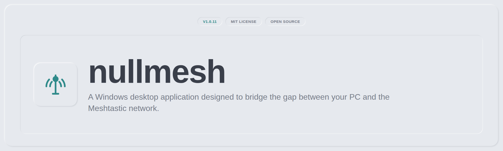

[](https://www.buymeacoffee.com/nullobj)

## The Problem

Meshtastic nodes are easy to talk to from a phone over Bluetooth, but a lot of that value happens away from your phone: a node sitting on a shelf near your router, reachable over Wi-Fi, quietly relaying a mesh you can't see without opening a companion app or a browser tool that assumes you'll wire up your own client.

There wasn't a proper desktop app for that. nullmesh is a Windows app that talks straight to a Meshtastic node over IP and gives you messaging, network visualization, telemetry and full device configuration in one window — no phone required.

## What's Inside

- **IP Connectivity** — connect to any Meshtastic node directly over TCP/IP or Wi-Fi, no Bluetooth or serial cable needed
- **Messaging** — direct messages and channel broadcasts, with delivery status, retries, and per-message signal info
- **Network Visualization** — a live map of every node your radio has heard, colour-coded by signal quality, with a detail popover for each
- **Telemetry & Peers** — battery, voltage, signal strength, and last-heard for every node on the mesh
- **Device Configuration** — read and write your radio's full config (device, position, power, network, display, LoRa, Bluetooth, module settings) from one screen

## Design Principles

- **Nothing reaches the radio unchecked.** Every config field the app can write is explicitly whitelisted and range-checked before it's sent — the radio never sees a value the UI didn't validate first.
- **IP-first, no lock-in.** nullmesh talks to your node over plain TCP/IP on your local network. No cloud account, no vendor bridge, no pairing dance.
- **One page, one job.** Messages, Peers, Map, Channels and Config are separate, focused pages rather than one dashboard trying to do everything at once.
- **A locked design system, not a pile of one-off styles.** The UI runs on [nullxx](https://github.com/BeardedTech0o/meshnatter/blob/main/tokens.json), a small token-driven design system — flat surfaces, a single teal accent, soft emboss shadows. Retint the whole app by changing tokens, not hundreds of individual rules.

## Installation

**Just want to run it?** Grab the latest installer from [Releases](https://github.com/BeardedTech0o/meshnatter/releases) — it's a standard Windows `.exe`, no Node.js or command line required.

**Building from source:**

```bash
git clone https://github.com/BeardedTech0o/meshnatter.git
cd meshnatter
pnpm install
pnpm start
```

To build your own installer, double-click `BUILD.bat` (or run `pnpm dist` — see [README-BUILD.md](README-BUILD.md) for details).

## Contributing

This is a personal project, tuned to one setup and one Meshtastic node's worth of testing. That said, if you hit a bug or have a suggestion, open an issue.
