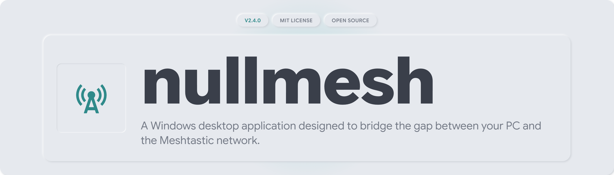

[](https://www.buymeacoffee.com/nullobj)

## The Problem

Meshtastic nodes talk easily to a phone over Bluetooth, but a node sitting on a shelf near your router, reachable over WiFi, is harder to see into. There was no proper desktop app for that. You had a companion app built for phones, or a browser tool that expected you to write your own client.

nullmesh is a Windows app that connects to a Meshtastic node over IP. It gives you messaging, network visualization, telemetry and full device configuration in one window.

## What's Inside

* **IP Connectivity.** Connect to a Meshtastic node directly over TCP/IP or WiFi. No Bluetooth or serial cable needed.
* **Messaging.** Direct messages and channel broadcasts, with delivery status, retries and signal info for each message.
* **Network Visualization.** A live map of every node your radio has heard, colored by signal quality, with a detail popup for each.
* **Telemetry and Peers.** Battery, voltage, signal strength and last heard time for every node on the mesh.
* **Device Configuration.** Read and write your radio's full config (device, position, power, network, display, LoRa, Bluetooth, module settings) from one screen.

## Design Principles

* **Nothing reaches the radio unchecked.** Every config field the app can write is whitelisted and range checked before it is sent. The radio never sees a value the UI did not validate first.
* **IP first.** nullmesh talks to your node over plain TCP/IP on your local network. No cloud account, no vendor bridge, no pairing required.
* **One page, one job.** Messages, Peers, Map, Channels and Config are separate pages, not one dashboard trying to do everything.
* **A locked design system.** The UI runs on nullxx, a small token driven design system: flat surfaces, one teal accent, soft shadows. Change the tokens and the whole app retints.

## Installation

Want to run it? Get the latest installer from [Releases](https://github.com/BeardedTech0o/nullmesh/releases). It is a standard Windows .exe. No Node.js or command line required.

Building from source:

```bash
git clone https://github.com/BeardedTech0o/nullmesh.git
cd nullmesh
pnpm install
pnpm start
```

To build your own installer, double click `BUILD.bat`, or run `pnpm dist`. See [README-BUILD.md](README-BUILD.md) for details.

## Contributing

This is a personal project, tuned to one setup and one Meshtastic node's worth of testing. If you hit a bug or have a suggestion, open an issue.
